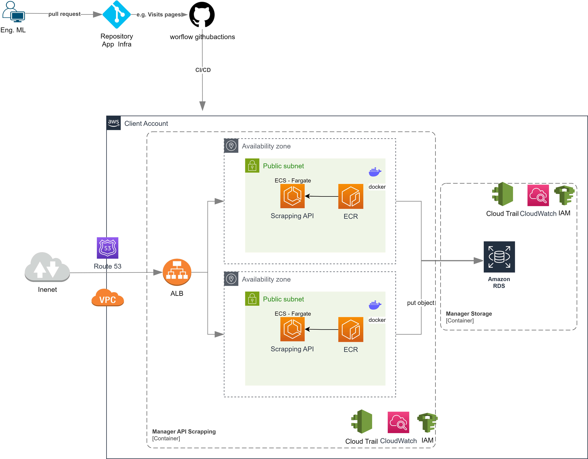

# Cenário: Previsão de Vendas e Identificação do Vinho Tinto Mais Lucrativo

## Objetivo:

Utilizar dados históricos de vitivinicultura da Embrapa para prever as vendas de vinhos no próximo ano e identificar qual vinho tinto é o mais lucrativo.

## Dados Necessários:

- Histórico de Produção e Vendas:
- Quantidade produzida e vendida de cada tipo de vinho.

## Análise de Modelos:

### Modelo de Previsão de Vendas:

#### Modelo: Regressão Linear
- A regressão linear é um modelo simples e eficaz para prever valores numéricos contínuos, como vendas futuras, com base em dados históricos. 
- Funciona bem quando há uma relação linear entre as variáveis independentes (dados históricos) e a variável dependente (vendas futuras).

## Arquitetura do Deploy

